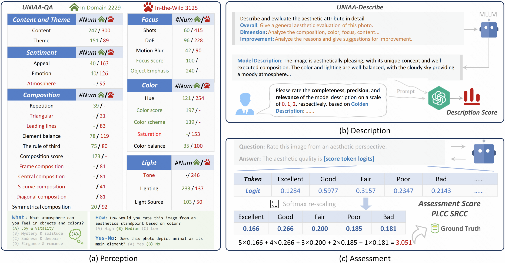

 

    

<!--  -->
<!--  -->
   

# Uniaa: A Unified Multi-modal Image Aesthetic Assessment Baseline and Benchmark

The Unified Multi-modal Image Aesthetic Assessment Framework, containing a baseline (a) and a benchmark  (b). The aesthetic perception performance of UNIAA-LLaVA and other MLLMs is shown in (c).

      

    
The IAA Datasets Conversion Paradigm for UNIAA-LLaVA.

      

The UNIAA-Bench overview. (a) UNIAA-QA contains 5354 Image-Question-Answer samples and (b) UNIAA-Describe contains 501 Image-Description samples. (c) For open-source MLLMs, Logits can be extracted to calculate the score.

      

## Release

- [4/15] 🔥 We build the page of UNIAA!
  

## Performance

### Aesthetic Perception Performance

  

### Aesthetic Description Performance

   

### Aesthetic Assessment Performance
#### Zero-shot

 

#### Supervised learning on AVA and TAD66K

  

## Training on data of UNIAA
#### Step 1: Download Images and Json files
#### Step 2: Training On Specific MLLM

## Test on UNIAA-Bench
### For Aesthetic Perception
#### Step 1: Download Images and Json files
#### Step 2: Run the inference code
#### Step 3: Calculate the score

### For Aesthetic Description
#### Step 1: Download Images and Json files
#### Step 2: Run the inference code
